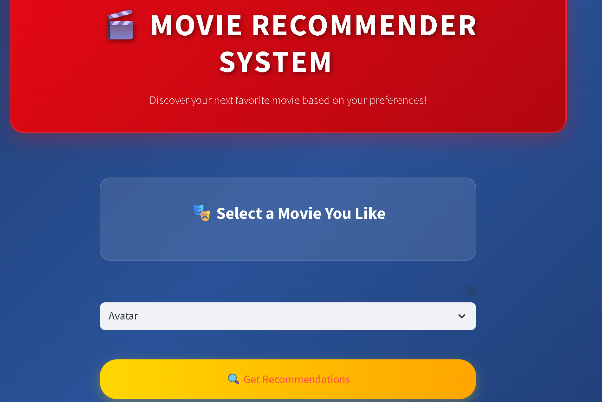

# 🎬 Movie Recommendation System

A content-based movie recommendation system built using machine learning techniques that suggests similar movies based on movie features like genres, cast, keywords, and plot overview.

## 📋 Table of Contents
- [Overview](#overview)
- [Features](#features)
- [Dataset](#dataset)
- [Installation](#installation)
- [Usage](#usage)
- [How It Works](#how-it-works)
- [Project Structure](#project-structure)
- [Technologies Used](#technologies-used)
- [Contributing](#contributing)

## 🎯 Overview

This Movie Recommendation System uses content-based filtering to recommend movies similar to a given movie. The system analyzes movie features such as genres, cast members, keywords, and plot summaries to find similarities between movies using cosine similarity.

## ✨ Features

- **Content-Based Filtering**: Recommends movies based on movie content and features
- **Text Processing**: Advanced text preprocessing including stemming and stop word removal
- **Cosine Similarity**: Uses cosine similarity to find similar movies
- **Top 5 Recommendations**: Returns the top 5 most similar movies
- **Pickle Support**: Saves processed data for quick loading in production

## 📊 Dataset

The system uses the TMDb 5000 Movie Dataset which includes:
- **tmdb_5000_movies.csv**: Contains movie information (genres, keywords, overview, etc.)
- **tmdb_5000_credits.csv**: Contains cast and crew information

### Dataset Features Used:
- Movie ID and Title
- Plot Overview
- Genres
- Keywords
- Top 3 Cast Members

## 🚀 Installation

1. **Clone the repository**
   \`\`\`bash
   git clone <repository-url>
   cd movie-recommendation-system
   \`\`\`

2. **Install required packages**
   \`\`\`bash
   pip install pandas numpy scikit-learn nltk pickle
   \`\`\`

3. **Download NLTK data** (if needed)
   \`\`\`python
   import nltk
   nltk.download('punkt')
   \`\`\`

4. **Ensure dataset files are present**
   - Place \`tmdb_5000_movies.csv\` and \`tmdb_5000_credits.csv\` in the project directory

## 💻 Usage

### Running the Recommendation System

1. **Process the data and create the model**
   \`\`\`bash
   python movie_recommender.py
   \`\`\`

2. **Get recommendations for a movie**
   \`\`\`python
   from movie_recommender import recommend
   
   # Get recommendations
   recommendations = recommend("Avatar")
   print(recommendations)
   \`\`\`

### Example Output
\`\`\`
Recommendations for 'Avatar':
1. Ender's Game
2. Guardians of the Galaxy
3. Star Trek
4. John Carter
5. Star Wars
\`\`\`

# Screenshots

1.

2.

## 🔧 How It Works

1. **Data Preprocessing**
   - Merge movie and credits datasets
   - Extract relevant features (genres, cast, keywords, overview)
   - Clean and process text data

2. **Feature Engineering**
   - Convert JSON-like strings to lists
   - Extract top 3 cast members
   - Remove spaces and convert to lowercase
   - Apply stemming to reduce words to root forms

3. **Vectorization**
   - Use CountVectorizer to convert text to numerical vectors
   - Limit to top 5000 features
   - Remove English stop words

4. **Similarity Calculation**
   - Calculate cosine similarity between all movies
   - Create similarity matrix

5. **Recommendation Generation**
   - Find the target movie's index
   - Get similarity scores with all other movies
   - Return top 5 most similar movies

## 📁 Project Structure

\`\`\`
movie-recommendation-system/
│
├── movie_recommender.py          # Main recommendation system code
├── Movie_Recommender_system.ipynb # Original Jupyter notebook
├── app.py                        # Web application (if applicable)
├── movies.pkl                    # Processed movie data
├── movie_dict.pkl               # Movie dictionary
├── similarity.pkl               # Similarity matrix
├── tmdb_5000_movies.csv         # Movie dataset
├── tmdb_5000_credits.csv        # Credits dataset
|── images                       # Screenshots
|    |── movies_recommendation.png    
|    |── web_ss.png
|── requirements.txt             # Libaries
|── run.bat                      # Code for Execution 
└── README.md                    # Project documentation
\`\`\`

## 🛠️ Technologies Used

- **Python 3.x**: Core programming language
- **Pandas**: Data manipulation and analysis
- **NumPy**: Numerical computing
- **Scikit-learn**: Machine learning library
  - CountVectorizer: Text vectorization
  - Cosine Similarity: Similarity calculation
- **NLTK**: Natural language processing
  - Porter Stemmer: Word stemming
- **Pickle**: Data serialization
- **AST**: Abstract Syntax Trees for parsing

## 🎯 Key Algorithms

### Content-Based Filtering
The system uses content-based filtering which recommends items similar to those a user has shown interest in, based on item features.

### Cosine Similarity
Measures the cosine of the angle between two vectors, providing a similarity score between 0 and 1.

### Porter Stemming
Reduces words to their root form (e.g., "running" → "run") to improve matching accuracy.

## 🚀 Future Enhancements

- Add collaborative filtering
- Implement hybrid recommendation approach
- Include user ratings and reviews
- Add more sophisticated NLP techniques
- Create a web interface for better user experience
- Add movie poster integration
- Implement real-time recommendations

🔗 Download Required File
This project requires a precomputed similarity matrix file: similarity.pkl, which is not included in the repository due to GitHub's file size limit.

👉 📥 Click here to download similarity.pkl(https://drive.google.com/file/d/1OrZoZWVDx7ZTEKPLP2eBg3Q_VAdTAq83/view?usp=drive_link)

After downloading:

Place similarity.pkl into the root folder (Movie-Recommendation-System/)

The file should sit beside app.py

## 🤝 Contributing

1. Fork the repository
2. Create a feature branch (\`git checkout -b feature/new-feature\`)
3. Commit your changes (\`git commit -am 'Add new feature'\`)
4. Push to the branch (\`git push origin feature/new-feature\`)
5. Create a Pull Request

## 📄 License

This project is open source and available under the [MIT License](LICENSE).

## 📞 Contact

For questions or suggestions, please open an issue in the repository.

---

**Note**: Make sure to have the required CSV files in your project directory before running the system.
\`\`\`
